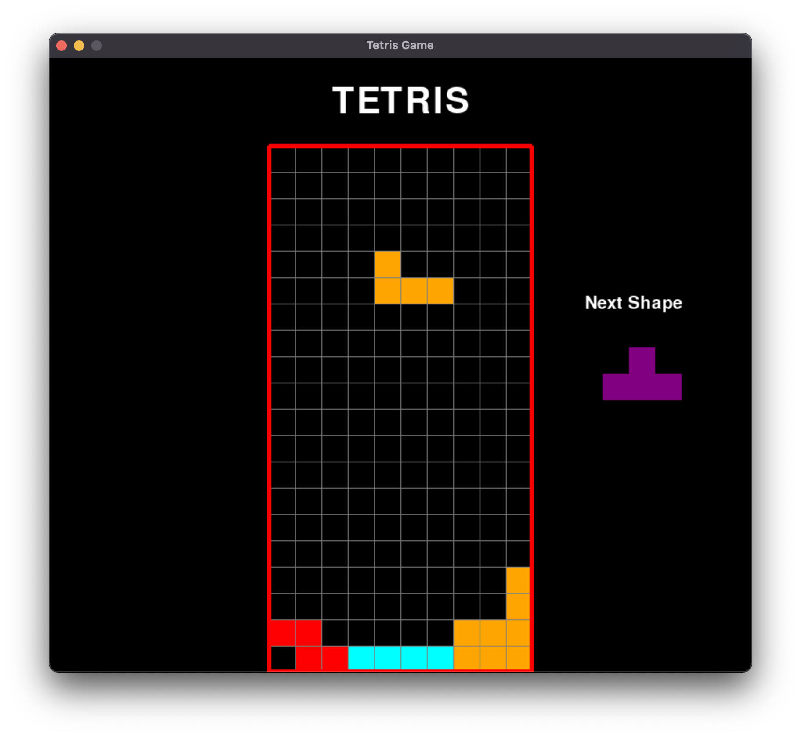

# **Tetris Game**

Course Project | CSCI-GA-2440 Software Engineering | Fall 2021

Courant Institute of Mathematical Sciences | New York University

Documentation: https://docs.google.com/document/d/1-1xNH0bmrjxnifx4WyyrgfNdHtdhdjCVrBUduBSd2c4/edit?usp=sharing

Presentation: https://docs.google.com/presentation/d/1cUc7rVYUCeYX0JkY5NLp_TrQXChufneeVTT-5XAaMVE/edit?usp=sharing


## Introduction

The project is the Python implementation of Tetris Game based on Pygame framework. 



#### Run the Program

Run `main.py` from command line and you start to play.

```shell
$ python3 main.py
```

#### Play Rules

At the beginning of the game, you can enter your username and set up the level of difficulty. Just like classical Tetris Game. You use *up* key to rotate a Tetromino, *left* key to move left and *right* key to move right. The right panel shows the Tetromino that is about to appear next. You lose if any piece get stacked up and reach the top of the grid.


## Authors

Ken S. ZHANG (sz1851@nyu.edu)

Qingyang LI (ql2048@nyu.edu)


## Requirements

- **Python 3.6**
- **Pytorch**
- **Numpy**
- **Pygame**

See  `requirements.txt` for details.
